# 🌌 Continuum `v0.1`

[](https://github.com/halidrauf/Continuum)
[](https://opensource.org/licenses/BSL-1.0)

**Continuum** is a database-centric worker designed to execute dynamic Python code in strict isolation. Decoupling the execution environment from the worker process, it provides a secure, scalable, and resilient platform for running untrusted or multi-tenant workloads.

### 🧩 Core Concept: Dynamic Isolation

Unlike traditional workers that execute code in-process, Continuum spawns and manages **independent Docker sandboxes**. Each task is injected into a persistent, pre-hardened container pool, ensuring that user-provided scripts never touch the worker host's kernel or filesystem.

- **Dynamic Execution:** Run arbitrary Python scripts on-the-fly via SQL triggers.
- **Strict Isolation:** Process, network, and resource namespaces are fully decoupled from the worker.

---

## 🏗️ Architecture

Continuum uses a decentralized architecture where workers communicate directly with a central database. This eliminates the need for a complex message broker while maintaining strict ACID compliance for task state.

```mermaid
%%{init: { 'theme': 'dark', 'themeVariables': { 'primaryColor': '#1f2937', 'primaryTextColor': '#f3f4f6', 'primaryBorderColor': '#3b82f6', 'lineColor': '#9ca3af', 'secondaryColor': '#111827', 'tertiaryColor': '#1f2937'}}}%%
graph TD
    subgraph WContainer ["Worker Environment (Container)"]
        direction TB
        subgraph WP ["Worker Process Internals"]
            direction LR
            W1[Worker Module]
            J[Janitor/Watchdog]
            R[Idle Reaper]
        end
        MD[Docker Daemon Link / Socket]
    end

    subgraph CP ["External Execution Pool"]
        T1([Persistent Python Container])
    end

    subgraph Storage ["Persistence Layer"]
        DB[(PostgreSQL / CockroachDB)]
    end

    %% Connections
    DB -- "LISTEN / NOTIFY<br/>(New Task Trigger)" --> W1
    W1 -- "FOR UPDATE<br/>SKIP LOCKED" --> DB
    W1 -- "Exec / Copy" --> T1
    W1 -- "Lifecycle Mgmt" --> MD
    T1 -- "Logs / Exit Code" --> W1
    
    J -- "Resurrect Zombie Tasks" --> DB
    R -- "Cleanup Inactive<br/>Containers" --> MD
    MD -. "DooD Orchestration" .-> T1

    %% Styling
    style WContainer fill:#111827,stroke:#3b82f6,stroke-width:2px
    style WP fill:#1f2937,stroke:#60a5fa,stroke-dasharray: 5 5
    style CP fill:#064e3b,stroke:#10b981,stroke-width:2px
    style Storage fill:#1e1b4b,stroke:#6366f1,stroke-width:2px
    style MD fill:#374151,stroke:#9ca3af
    style T1 fill:#065f46,stroke:#34d399
```



### 3. Persistent & Isolated Execution

Continuum uses a high-performance container pooling strategy to minimize execution overhead.

- **Container Reuse:** Instead of spawning a new container for every task, valid containers are kept running and reused via Docker's `Exec` API.
- **Instant Initialization:** Security rules (`iptables`) and sandboxed users are provisioned once during the container's cold start, eliminating repeated setup latency.
- **Resource Efficiency:** Containers are automatically pruned by an **Idle Reaper** based on a configurable timeout.
- **Security:** Each task is still strictly isolated; process namespaces are cleared and file ownership is reset before every new execution.

---

## 🚀 Key Features

### 1. Atomic Task Claiming

Multiple concurrent workers can request tasks without collisions. Using `FOR UPDATE SKIP LOCKED`, we ensure a non-blocking, atomic "Pull" mechanism.

- **Benefit:** 100% horizontal scalability with 0% duplicate task execution.

### 2. Fault Recovery (The Watchdog)

Continuum implements a multi-layered recovery strategy:

- **Worker Crash Recovery:** A background process detects tasks stuck in `processing` beyond a defined TTL and marks them for retry or failure.
- **Execution Retries:** Individual tasks are automatically retried up to 3 times upon engine level failures.

### 3. Sub-Second Latency (Persistent Pooling)

Using a container pooling strategy, Continuum achieves sub-second execution latency.

- **Warm Pools:** Reuses pre-initialized containers via the Docker `Exec` API.
- **Zero-Setup Overhead:** Transfers code/payload directly into running sandboxes, bypassing the "Create -> Start -> Init" cycle.

### 4. Real-Time Monitoring & Metrics

Every worker exposes a built-in HTTP API server for health checks and performance analysis.

- **`/status`:** Real-time metrics for individual workers (uptime, success/fail counts).
- **`/global-status`:** Aggregated system-wide performance (throughput, average execution time, queue depth).
- **`OpenTelemetry Support`:** Distributed tracing and metrics for monitoring and observability.

### 5. Multitenant Security Sandbox

Defense-in-depth isolation for untrusted code execution:

- **Network Isolation:** Strict `iptables` egress filtering and dedicated bridge networks with blocked host access.
- **Privilege Separation:** Scripts run as restricted, non-root `sandboxuser`.
- **Resource Quotas:** Hard limits on CPU and Memory usage per container.

### 6. Low-Latency Triggering

Leverages PostgreSQL's native `LISTEN/NOTIFY` system to wake workers immediately when new tasks arrive, supplemented by periodic fallback polling for extreme reliability.

---

## 🛡️ High Availability & SPOF Prevention

While Continuum is designed to have no central *application* point of failure, the database itself can become a Single Point of Failure (SPOF) in a standard single-node PostgreSQL setup.

> [!IMPORTANT]
> **Recommendation: Use CockroachDB**
> To ensure the entire system is truly distributed and resilient, we recommend deploying with **CockroachDB**. It is fully compatible with the PostgreSQL wire protocol and supports `SKIP LOCKED`. Using CockroachDB provides:
>
> - **Multi-region resilience:** Automated replication and failover.
> - **Horizontal Scaling:** Scales the storage layer alongside your workers.
> - **No SPOF:** Eliminates the database as a single point of failure.

---

## 🗄️ Database Schema

Continuum's persistence layer is built around two primary tables that manage code reusability and task lifecycle.

### 1. `CODES` Table

Stores the actual logic/scripts to be executed. This allows multiple tasks to reference the same codebase, reducing storage redundancy.

| Column   | Type     | Description                                           |
| :------- | :------- | :---------------------------------------------------- |
| `id`   | `UUID` | Primary key, automatically generated.                 |
| `code` | `TEXT` | The source code (e.g., Python script) to be executed. |

### 2. `TASKS` Table

The heart of the orchestrator, tracking every step of a task's execution.

| Column          | Type          | Description                                                              |
| :-------------- | :------------ | :----------------------------------------------------------------------- |
| `id`          | `SERIAL`    | Unique task identifier.                                                  |
| `name`        | `TEXT`      | Human-readable name for the task.                                        |
| `description` | `TEXT`      | Detailed explanation of what the task does.                              |
| `status`      | `VARCHAR`   | Current state:`pending`, `processing`, `completed`, or `failed`. |
| `payload`     | `JSONB`     | Structured data passed to the script as arguments/environment.           |
| `code`        | `UUID`      | Foreign key referencing the `CODES` table.                             |
| `worker_id`   | `TEXT`      | Identifier of the worker currently processing the task.                  |
| `started`     | `TIMESTAMP` | When the task execution began.                                           |
| `finished`    | `TIMESTAMP` | When the task execution completed.                                       |
| `locked_at`   | `TIMESTAMP` | Timestamp used for concurrency control and TTL checks.                   |
| `last_error`  | `TEXT`      | Stores the stack trace or error message if the task fails.               |
| `output`      | `TEXT`      | The standard output (stdout) from the task execution.                    |
| `priority`    | `INTEGER`   | The priority of the task. Lower numbers indicate higher priority.        |

---

## ⚙️ Database Setup

To enable high-performance task orchestration, Continuum uses PostgreSQL's `NOTIFY/LISTEN` system. This ensures workers are alerted immediately when new work arrives, minimizing polling latency.

### 1. Schema Initialization

Initialize your database using the provided `init.sql` file. This creates the tables, notification functions, and triggers.

### 2. Real-time Notifications

The following trigger automatically notifies all active workers whenever a task is inserted or updated:

```sql
CREATE OR REPLACE FUNCTION notify_task_change()
RETURNS TRIGGER AS $$
BEGIN
    PERFORM pg_notify('tasks_updated', 'New or updated task');
    RETURN NEW;
END;
$$ LANGUAGE plpgsql;

CREATE TRIGGER task_change_trigger
AFTER INSERT OR UPDATE ON TASKS
FOR EACH ROW
EXECUTE FUNCTION notify_task_change();
```

---

## 🛠️ Technical Specifications

- **Runtime:** Go 1.25+
- **Container Runtime:** Docker (Daemon must be accessible via socket/env)
- **Database:** PostgreSQL 9.5+ (Required for `SKIP LOCKED`) or CockroachDB.
- **Concurrency:** Designed for high-contention scenarios without database deadlocks.
- **Monitoring:**  OpenTelemetry support for distributed tracing and metrics.

---

## ⚙️ Configuration

Continuum is configured using environment variables, typically stored in a `.env` file in the root directory.

| Variable                   | Default       | Description                                                                                                       |
| :------------------------- | :------------ | :---------------------------------------------------------------------------------------------------------------- |
| `DB_USER`                | `user`      | PostgreSQL database username.                                                                                     |
| `DB_PASSWORD`            | `password`  | PostgreSQL database password.                                                                                     |
| `DB_NAME`                | `continuum` | Name of the database.                                                                                             |
| `DB_HOST`                | `localhost` | Database host (use `postgres` if running in Docker).                                                            |
| `DB_PORT`                | `5432`      | Database port.                                                                                                    |
| `CONTAINER_MEMORY_MB`    | `512`       | Memory limit for each task container in MB.                                                                       |
| `CONTAINER_CPU_LIMIT`    | `0.5`       | Fractional CPU limit for each task container.                                                                     |
| `CONTAINER_IDLE_TIMEOUT` | `5m`        | How long a container stays alive after its last task.                                                             |
| `POLLING_INTERVAL`       | `5`         | How often the worker polls for new tasks in seconds as a fallback in case of failure of the LISTEN/NOTIFY system. |
| `MIN_PRIORITY`           | `0`         | Minimum priority for tasks to be picked up.                                                                      |
| `MAX_PRIORITY`           | `0`         | Maximum priority for tasks to be picked up.                                                                      |
| `CONTAINER_IMAGE`        | `python:3.9-slim` | Docker image to use for task containers. |

> [!TIP]
> When running with the provided `docker-compose.yml`, the `DB_HOST` should be set to `postgres`. Note that the `docker-compose` setup is specifically designed for **local testing and benchmarking** purposes.

## 🛡️ Robustness & Recovery

Continuum implements a multi-layered recovery strategy:

### 1. Container Watchdog

If a task's Docker container fails (non-zero exit code or engine error), the worker automatically retries execution **3 times** with a backoff delay before marking the task as failed.

### 2. Zombie Task Recovery

In the event of a hard worker crash (e.g., node failure, OOM), tasks might remain locked in the `running` state.

- **Auto-Detection:** Workers perform a health check on startup and periodically.
- **Action:** Any task stuck in `running` state for more than **1 hour** is automatically detected and marked as `failed` with a "Timeout/Crash" error. This prevents "poison pill" tasks from blocking the queue indefinitely.

### 3. Graceful Lifecycle Management

Workers handle OS signals (SIGTERM, SIGINT) to ensure a clean exit.

- **Cleanup:** Active containers are gracefully stopped and removed upon worker shutdown.
- **Resource Discipline:** Ensures no dangling containers are left behind on the host.

---

## 🛡️ Security

Continuum prioritizes execution isolation and defense-in-depth through multi-layered security measures:

### 1. Privilege Isolation (Non-Root Execution)

Each Python script is executed as a restricted `sandboxuser` within the container.

- **Restriction:** The script cannot perform administrative tasks, write to system directories (like `/root`), or modify container configurations.
- **Verification:** Security tests ensure that even if a script reaches out of the Python interpreter, it is blocked by OS-level permissions.

### 2. Network Sandboxing

The execution environment uses a dedicated sandbox network with strict egress filtering:

- **Internal Blocking:** All internal Docker and host network ranges (10.0.0.0/8, 172.16.0.0/12, 192.168.0.0/16, etc.) are blocked using `iptables`.
- **DNS Redirection:** Sensitive hostnames like `host.docker.internal` are redirected to `127.0.0.1` (a dead end) to prevent lateral movement.
- **External Access:** High-performance tasks can still reach the public internet for API calls if required.

### 3. Resource & Infrastructure Security

- **Resource Constraints:** Tasks are limited by default to 512MB RAM and 0.5 CPU to prevent resource exhaustion attacks (configurable via `.env`).
- **DooD Risk:** The current version uses Docker-outside-of-Docker for simplicity. While this provides process isolation, it implies that the worker has access to the host's Docker socket.
- **Roadmap:** Future releases will migrate to **gVisor** or **Kata Containers** for strong kernel-level isolation.

---

## 🤝 The Idempotency Contract

Continuum provides **"At-Least-Once"** delivery guarantees. If a worker crashes after successfully executing a task but before updating the database state, the task may be retried by another worker.

> [!IMPORTANT]
> **Requirement: Design for Idempotency**
> Users of Continuum must design their tasks to be **idempotent**. This means that executing the same task multiple times should have the same side effects as executing it once.
>
> *Example:* If your task sends an email, it should check if the email has already been sent for that specific task ID before sending it again.

---

---

## ⚠️ Known Limitations

> [!CAUTION]
> **Not Production Grade**
> Continuum is currently in a **Pre-Alpha (v0.1)** state. It is a proof-of-concept for database-centric orchestration and should not be used for mission-critical production workloads without significant hardening.

### 1. Security & Isolation

- **DooD Dependency:** The reliance on Docker-outside-of-Docker means a container escape could lead to host-level Docker daemon access. Production environments should use **gVisor** or **Kata Containers**.
- **On-the-fly Setup:** Security tools (like `iptables`) are installed during the initial container cold start. This adds latency to the first task execution, though it is amortized across subsequent reused executions in the pool.

### 2. Infrastructure & Scaling

- **Database SPOF:** Unless deployed with a distributed database like **CockroachDB**, the central PostgreSQL instance remains a single point of failure.
- **No Global Rate Limiting:** While individual containers have resource limits, there is no global orchestrator-level rate limiting or backpressure mechanism.
- **Static Dependencies:** The current execution environment is restricted to a static Python image. There is no native support for `pip install` or custom `requirements.txt` pre-bundling.

### 3. Reliability

- **At-Least-Once Only:** Due to the nature of distributed systems, exactly-once delivery is not supported. All tasks must be designed to be **idempotent**.

---

## 📊 Performance Benchmarks (v0.1)

Conducted on a standard development machine with 10 worker replicas.

| Metric                        | Result            | Notes                                  |
| :---------------------------- | :---------------- | :------------------------------------- |
| **Avg Execution Delay** | **658ms**   | Including DB roundtrip and Docker Exec |
| **Burst Throughput**    | **~15 tps** | Sustained across 10 workers            |
| **Success Rate**        | **100%**    | Verified with 2000+ benchmarked tasks  |
| **Cold Start Penalty**  | ~3,500ms          | Only happens once when pool is empty   |
